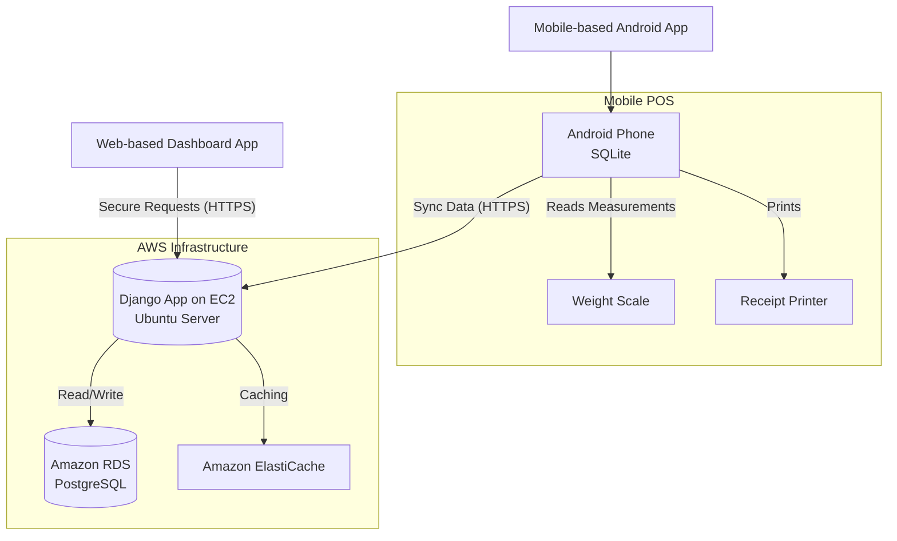

```mermaid
flowchart TB
    %% Top-to-Bottom flowchart

    subgraph Mobile POS
        RNApp[Android Phone<br>SQLite]
        WeightScale[Weight Scale]
        Printer[Receipt Printer]
        RNApp -- Reads Measurements --> WeightScale
        RNApp -- Prints --> Printer
    end

    RNApp -- Sync Data (HTTPS) --> DjangoEC2[(Django App on EC2<br>Ubuntu Server)]

    subgraph AWS Infrastructure
        RDS[(Amazon RDS<br>PostgreSQL)]
        ElastiCache[Amazon ElastiCache]
        DjangoEC2 -- Read/Write --> RDS
        DjangoEC2 -- Caching --> ElastiCache
    end

    Dashboard[Web-based Dashboard App] -- Secure Requests (HTTPS) --> DjangoEC2
    POC[Mobile-based Android App] --> RNApp
```
