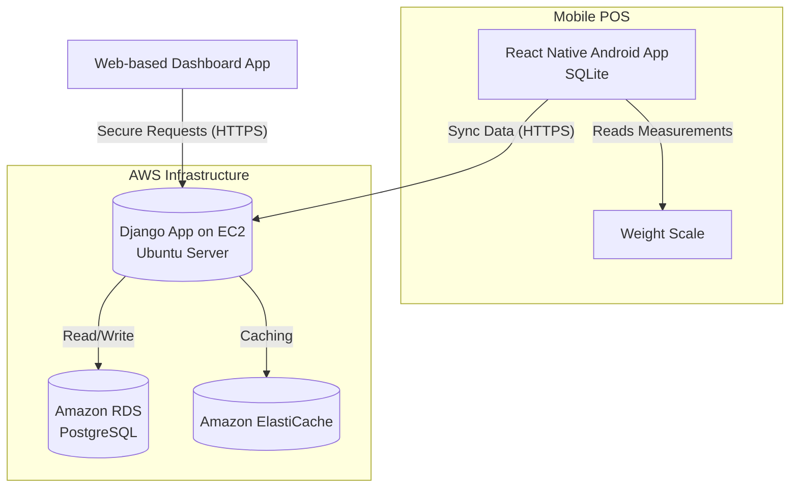

```mermaid
flowchart TB
    %% Top-to-Bottom flowchart

    subgraph Mobile POS
        RNApp[React Native Android App<br>SQLite]
        WeightScale[Weight Scale]
        RNApp -- Reads Measurements --> WeightScale
    end

    RNApp -- Sync Data (HTTPS) --> DjangoEC2[(Django App on EC2<br>Ubuntu Server)]

    subgraph AWS Infrastructure
        RDS[(Amazon RDS<br>PostgreSQL)]
        ElastiCache[(Amazon ElastiCache)]
        DjangoEC2 -- Read/Write --> RDS
        DjangoEC2 -- Caching --> ElastiCache
    end

    Dashboard[Web-based Dashboard App] -- Secure Requests (HTTPS) --> DjangoEC2
```
