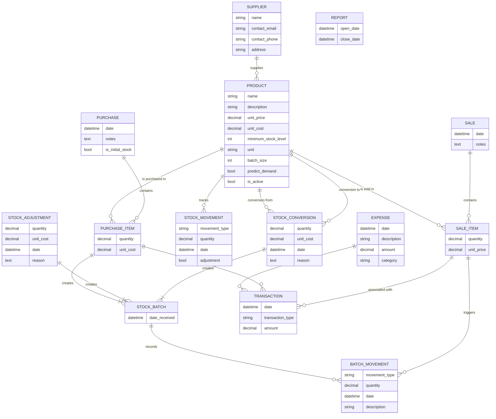

```mermaid
erDiagram
    SUPPLIER {
        string name
        string contact_email
        string contact_phone
        string address
    }
    PRODUCT {
        string name
        string description
        decimal unit_price
        decimal unit_cost
        int minimum_stock_level
        string unit
        int batch_size
        bool predict_demand
        bool is_active
    }
    PURCHASE {
        datetime date
        text notes
        bool is_initial_stock
    }
    PURCHASE_ITEM {
        decimal quantity
        decimal unit_cost
    }
    SALE {
        datetime date
        text notes
    }
    SALE_ITEM {
        decimal quantity
        decimal unit_price
    }
    STOCK_BATCH {
        datetime date_received
    }
    BATCH_MOVEMENT {
        string movement_type
        decimal quantity
        datetime date
        string description
    }
    STOCK_MOVEMENT {
        string movement_type
        decimal quantity
        datetime date
        bool adjustment
    }
    STOCK_ADJUSTMENT {
        decimal quantity
        decimal unit_cost
        datetime date
        text reason
    }
    STOCK_CONVERSION {
        decimal quantity
        decimal unit_cost
        datetime date
        text reason
    }
    EXPENSE {
        datetime date
        string description
        decimal amount
        string category
    }
    TRANSACTION {
        datetime date
        string transaction_type
        decimal amount
    }
    REPORT {
        datetime open_date
        datetime close_date
    }

    SUPPLIER ||--o{ PRODUCT : supplies
    PRODUCT ||--o{ PURCHASE_ITEM : "is purchased in"
    PURCHASE ||--o{ PURCHASE_ITEM : "contains"
    PRODUCT ||--o{ SALE_ITEM : "is sold in"
    SALE ||--o{ SALE_ITEM : "contains"
    PRODUCT ||--o{ STOCK_MOVEMENT : "tracks"
    PURCHASE_ITEM ||--|{ STOCK_BATCH : "creates"
    STOCK_ADJUSTMENT ||--|{ STOCK_BATCH : "creates"
    STOCK_CONVERSION ||--|{ STOCK_BATCH : "creates"
    STOCK_BATCH ||--o{ BATCH_MOVEMENT : "records"
    SALE_ITEM ||--o{ BATCH_MOVEMENT : "triggers"
    EXPENSE ||--o{ TRANSACTION : "associated with"
    PURCHASE_ITEM ||--o{ TRANSACTION : "associated with"
    SALE_ITEM ||--o{ TRANSACTION : "associated with"
    PRODUCT ||--o{ STOCK_CONVERSION : "conversion from"
    PRODUCT ||--o{ STOCK_CONVERSION : "conversion to"
```
