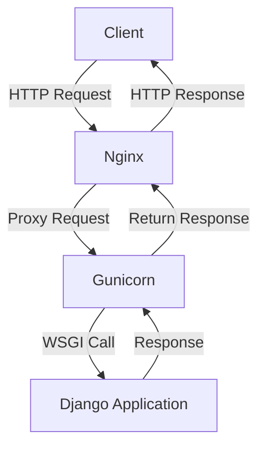

```mermaid
graph TD
    A[Client] -->|HTTP Request| B[Nginx]
    B -->|Proxy Request| C[Gunicorn]
    C -->|WSGI Call| D[Django Application]
    D -->|Response| C
    C -->|Return Response| B
    B -->|HTTP Response| A
```
